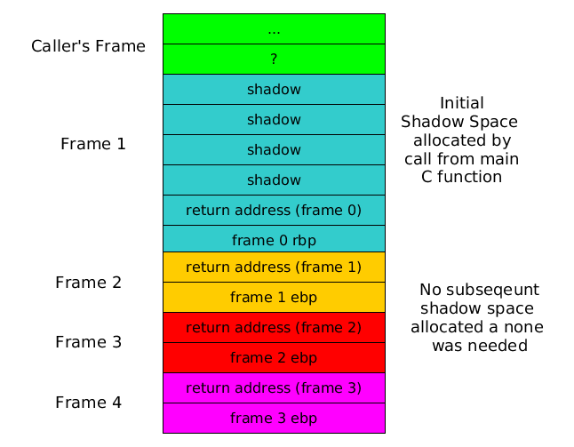

# Tutorial 2: Function Calling in x86_64
Name: Stefano Lupo   
Student Number: 14334933   
Date: 15/10/17   
Course: Computer Engineering   
Module: CS3421 Computer Architecture II   
   

# Q1 IA32 Code for the Three Functions
## int min(int a, int b, int c)
This function returns the minimum of `a`, `b`, and `c`.
```Assembly
min:
  // Save context
  push rbp                  // Save caller's frame pointer
  mov rbp, rsp              // Set the frame pointer to the current value of the stack pointer (which just pushed)

  mov rax, rcx              // rax = v = a
  
  cmp rdx, rax              // cmp(b,v)
  jge b_greatereq_v
  mov rax, rdx              // v = b

b_greatereq_v:

  cmp r8, rax               // cmp(c,v)
  jge c_greatereq_v
  mov rax, r8               // v = c

c_greatereq_v:  

  // Restore context
  mov rsp, rbp
  pop rbp
  ret
```


## int p(int i, int j, int k, int l)
This function returns the minimum of the 4 passed parameters `i`, `j`, `k`, `l` and global variable `g` by making use of the previously defined `min` function.

```Assembly
p: 
  // Save context
  push ebp                  // Save old frame pointer
  mov ebp, esp              // Set our new frame pointer
  sub esp, 4                // Allocate space for local variables
  // NA                     // Save non volatile registers (ebx)

p: 
  // Save context
  push rbp                  // Save old frame pointer
  mov rbp, rsp              // Set our new frame pointer

  push r8                   // save k
  push r9                   // save l
  mov r8, g

                            // i = rcx, j = rdx, rdx = r8
  sub rsp, 32               // Allocate 32 bytes (although it is unused for our function) of shadow space (4x64 bit words)
  call min                  // rax = min(g, i, j)
  add rsp, 32               // Deallocate the 32 bytes of shaodwspace

  mov rcx, rax              // rcx = rax = min(i,j,g)
  pop rdx                   // rdx = k
  pop r8                    // r8 = l

  sub rsp, 32               // Allocate 32 bytes of shadow space (4x64 bit words)
  call min                  // min(min(i,j,g), k, l)
  add rsp, 32               // Deallocate the 32 bytes of shaodwspace
                
p_restore:
  // Restore context
  mov rsp, rbp
  pop rbp
  ret
```

## int gcd(int a, int b)
This recusrive function find the greatest common divisor of `a` and `b`.   
```Assembly
gcd: 
  // Save context
  push rbp                  // Save old frame pointer
  mov rbp, rsp              // Set our new frame pointer

  // Check if b is zero
  test rdx, rdx             // rdx && rdx (zero iff rdx was 0)
  je gcd_zero


  /*
    idiv divides the 128 bits across RDX|RAX by the operand
    idiv stores the result of the division in RAX and the remainder in RDX
 */

  mov r10, rdx              // save b in r10

  mov rax, rcx              // prepare rax for sign extension
  cqo                       // sign extends rax into 128 bits accross rdx:rax

  idiv r10                  // rax = (rdx|rax) / r10, rdx = (rdx|rax) % r10
  mov rcx, r10              // rcx = b, rdx = a % b

  // recurse gcd(b, a%b) - No need for shadow space as function doesnt make use of it or call any other functions that do
  call gcd
  jmp gcd_return


gcd_zero:
  mov rax, rcx              // return a

gcd_return: 
  // Restore context
  mov rsp, rbp
  pop rbp
  ret

```
   
## int q(int a, int b, int c, int d, int e)
This function prints and returns the sum of the 5 passed parameters.
```Assembly
q:
  // Save context
  push rbp                  // Save old frame pointer
  mov rbp, rsp              // Set our new frame pointer

  mov r10, [rbp+48]         // r10 = e
  xor rax, rax              // rax = 0

  add rax, rcx
  add rax, rdx
  add rax, r8
  add rax, r9
  add rax, r10
  push rax                  // save sum to stack before calling printf

  sub rsp, 32               // Allocate shadow space for printf

  lea rcx, format
  mov rdx, 99
  call printf

  add rsp, 32               // deallocate shadow space
  pop rax                   // retrieve sum


  // Restore context
  mov rsp, rbp
  pop rbp
  ret
```
   
## void shadowSpace()
This function shows that shadown space **must** be allocated when calling the `printf` function.
```Assembly
shadowSpace:
  // Save context
  push rbp                  // Save old frame pointer
  mov rbp, rsp              // Set our new frame pointer

  lea rcx, format
  mov rdx, 99
  call printf  

  // Restore context
  mov rsp, rbp
  pop rbp
  ret
```


# Q2: Stack for gcd(14, 21)
In computing the gcd of 14 and 21, code execution would be as follows:
```
1 gcd(14,21)
   b != 0
   return gcd(b, a % b) - return gcd(21, 14)
2 gcd(21, 14)
   b != 0
   return gcd(b, a % b) - return gcd(14, 7)
3 gcd(14, 7)
   b != 0
   return gcd(b, a % b) - return gcd(7, 0)
4 gcd(7, 0)
   b == 0
   return a - return 7
```
   
This shows that the maximum depth of stack (in stack frames) is 4.   
As the recusrive gcd function made no use of the shadow space, no further shadow space was allocated between recursive calls to save memory.
   
This means the stack would contain the following:



# Q3: Testing the Functions *(test.c)*
This small C program can test each of the functions.   
```c
#include <stdio.h>
#include <time.h>
#include <stdlib.h>

#include "asmFunctions.h"

int64_t actualGCD(int64_t a, int64_t b) {
    if(b==0) {
        return a;
    }

    return actualGCD(b, (a % b));
}

int main() {
    // Set seed for random numbers
    srand(time(NULL));

    int64_t a = 100, b = 50, c = -3, d = -15;
    printf("Min: The minimum of %" PRId64 ", %" PRId64 ", %" PRId64 " is %" PRId64 "\n", a, b, c, min(a,b,c));
    printf("P: The minimum of %" PRId64 ", %" PRId64 ", %" PRId64 ", %" PRId64 " and g (4) is %" PRId64" \n", a, b, c, d, p(a,b,c,d));

    printf("\nGCD: gcd(%" PRId64 ",%" PRId64 ") = %" PRId64 "\n", a, b, gcd(a, b));
    printf("actualGCDcd(%" PRId64 ", %" PRId64 ") = %" PRId64 "\n\n", a, b, actualGCD(a, b));

    // Test two algorithms 100 times
    for(int i=0;i<10;i++) {
        int x = rand() % 100, y = rand() % 100;
        int actual = actualGCD(x,y);
        int assembly = gcd(x,y);

        if(actual != assembly) {
            printf("Error in algorithm\n");
            printf("gcd(%d, %d) = %d but algorithm returned %d\n\n", x, y, actual, assembly);
            exit(0);
        }
    }   
    printf("100 tests were successfull\n\n");   
    
    q();
    shadowSpace();

    return 0;
}
```
   
This produced the following console output, indiciating that all of the functions work correctly.
   


