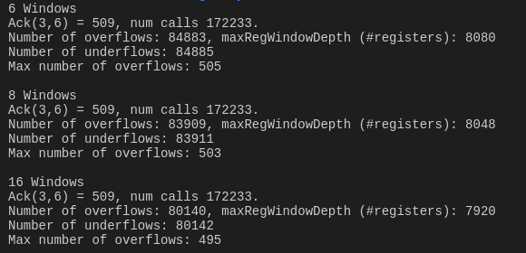
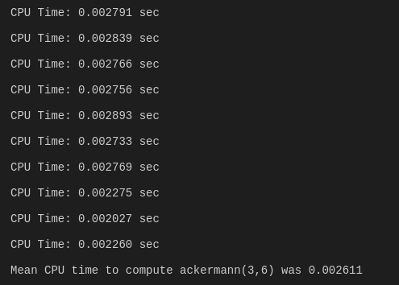

# Tutorial 3: RISC-1
Name: Stefano Lupo   
Student Number: 14334933   
Date: 10/11/17   
Course: Computer Engineering   
Module: CS3421 Computer Architecture II   
   
# Q1 RISC-1 Code Translation
Note: assuming jumps are the same as x86
Convention:
- r1 : return value
- r2 - r9 : globals
- r10 - r15 : params to pass to func 
- r16 - r24 : local vars
- r25 : return address
- r26 - r31 : passed params

Note : sub Ra, Rb, R0 --> R0 = Ra - Rb

## min(int a, int b, int c)
The function in C.
```c
int g = 4;
int min(int a, int b, int c) {
    int v = a;
    if (b < v)
        v = b;
    if (c < v)
        v = c;
    return v;
}
```

## Unoptimized RISC-1 Equivalent
```Assembly
add r0, #4, r9              ; r9 = g = 4

; Min is called with the following params - a:r26, b:r27, c:r28.
min: 
    add r26, r0, r1         ; v = r1 = a
    sub r27, r1, r0 {C}     ; cmp b, v  throw away result and set CCF
    jge min0                ;
    xor r0, r0, r0          ; no op
    add r27, r0, r1         ; r1 = r27 (v = b)
min0:
    sub r28, r1, r0 {C}     ; c < v?
    jge min1
    xor r0, r0, r0
    add r28, r0, r1         ; v = c
min1:
    ret r25, 0              ; return to address contained in r25
    xor r0, r0, r0
```
    
No optimizations possible.


## int p(int i, int j, int k, int l)
The slightly adjusted function in C.
```c
int p(int i, int j, int, k, int l) {
    int x = min(g, i, j);
    return min(x, k, l);
}
```


Unoptimized RISC-1
i = r26, j=r27, k=r28, l=r29
```Assembly
p:
    ; Setup params for intermediate min call
    add r9, r0, r10                 ; param1 = g
    add r26, r0, r11                ; param2 = i
    add r27, r0, r12                ; param3 = j
    callr r25, min                  ; call min and save return address in r25
    xor r0, r0, r0                  ; no op

    ; Result of min is now in r1, we want this to be first param to next call
    add r1, r0, r10                 ; param1 = min(g, i, j)
    add r28, r0, r11                ; param2 = k
    add r29, r0, r12                ; param3 = l
    callr r25, min                  ; 
    xor r0, r0, r0                  ; delay slot

    ; Result now is already contained in r1
    ret r25, 0
    xor r0, r0, r0                  ; no op
    
```

### Optimised
We note that we can put one parameter in a register AFTER calling the function that requires that parameter.
```Assembly
p:
    ; Setup params for intermediate min
    add r9, r0, r10                 ; param1 = g
    add r26, r0, r11                ; param2 = i
    callr r25, min                  ; call p and save return address in r25
    add r12, r0, r12                ; param3 = j

    ; Result of min is now in r1, we want this to be first param to next call
    add r1, r0, r10                 ; param1 = min(g, i, j)
    add r28, r0, r11                ; param2 = k
    callr r25, min                  ; 
    add r29, r0, r12                ; param3 = l

    ; Result now is already contained in r1
    ret r25, 0
    xor r0, r0, r0                  ; no op
    
```


## int gcd(int a, int b)
Note assuming a `mod` function exists in RISC-1 such that: `mod Ra, Rb, Rd`  is  `Rd <- Ra % Rb`
The function in C is the following.
```c
int gcd(int a, int b) {
    if (b == 0) {
        return a;
    } else {
        return gcd(b, a % b);
    }
}
```

The function in unoptimized RISC-1   
a = r26, b = r27
```Assembly
gcd:
    sub r27, r0, r0 {C}         ; cmp r27, #0
    jne repeat
    xor r0, r0, r0              ; no op
    add r0, r26, r1             ; r1 = a
    ret r25, 0                  ; return a
    xor r0, r0, r0              ; no op
repeat:
    mod r26, r27, r11           ; param2 = a % b
    add r27, r0, r10            ; param1 = b
    callr r25, gcd              ; gcd(b, a%b)
    xor r0, r0, r0              ; no op
    ret r25, 0                  ; return gcd(b, a%b)
    xor r0, r0, r0              ; no op

```

The function in optimized RISC-1
a = r26, b = r27
```Assembly
gcd:
    sub r27, r0, r0 {C}         ; cmp r27, #0
    jne recurse                 
    xor r0, r0, r0              ; no op
    add r0, r26, r1             ; r1 = a
    ret r25, 0                  ; return a
    xor r0, r0, r0              ; no op
recurse:
    mod r26, r27, r11           ; param2 = a % b
    callr r25, gcd              ; gcd(_, a%b)
    add r27, r0, r10            ; _ = b
    ret r25, 0                  ; return gcd(b, a%b)
    xor r0, r0, r0              ; no op
```

    
# Q2 Ackermann Function on a RISC-1 Machine
In order to simulate the running of `ackermann(3, 6)` on a RISC-1 machine, the following C code was used.

```c
#include <stdio.h>

int numWindows;
int windowsUsed;
int numOverflows;
int numUnderflows;
int numCalls;

int currentNumOverflows;
int maxNumOverflows;

void overFlow() {
  if(windowsUsed == numWindows) {
    numOverflows ++;
    currentNumOverflows++;
    if(currentNumOverflows > maxNumOverflows) {
      maxNumOverflows = currentNumOverflows;
    }
  } else {
    windowsUsed ++;
  }
}

void underFlow() {
    if(windowsUsed == 2) {
      numUnderflows ++;
      currentNumOverflows --;
    } else {
      windowsUsed --;
    }
}


int ackermann(int x, int y) {
  numCalls ++;
  overFlow();

  if(x==0) {
    underFlow();
    return y+1;
  } else if(y==0) { 
    int val = ackermann(x-1, 1);
    underFlow();
    return val;
  } else {
    int val = ackermann(x-1, ackermann(x, y-1));
    underFlow();
    return val;
  }
}

void resetVars(int _numWindows) {
  numWindows = _numWindows;
  windowsUsed = 0;
  numOverflows = 0;
  numUnderflows = 0;
  numCalls = 0;
  maxNumOverflows = 0;
  currentNumOverflows = 0;
  
}

int main() {
  resetVars(6);
  int ans = ackermann(3,6);
  printf("6 Windows\n");
  printf("Ack(3,6) = %d, num calls %d.\n", ans, numCalls);
  printf("Number of overflows: %d, maxRegWindowDepth (#registers): %d\n", numOverflows, maxNumOverflows*16);
  printf("Number of underflows: %d\n", numUnderflows);
  printf("Max number of overflows: %d\n\n", maxNumOverflows);

  resetVars(8);
  ans = ackermann(3,6);
  printf("8 Windows\n");
  printf("Ack(3,6) = %d, num calls %d.\n", ans, numCalls);
  printf("Number of overflows: %d, maxRegWindowDepth (#registers): %d\n", numOverflows, maxNumOverflows*16);
  printf("Number of underflows: %d\n", numUnderflows);
  printf("Max number of overflows: %d\n\n", maxNumOverflows);

  resetVars(16);
  ans = ackermann(3,6);
  printf("16 Windows\n");
  printf("Ack(3,6) = %d, num calls %d.\n", ans, numCalls);
  printf("Number of overflows: %d, maxRegWindowDepth (#registers): %d\n", numOverflows, maxNumOverflows*16);
  printf("Number of underflows: %d\n", numUnderflows);
  printf("Max number of overflows: %d\n\n", maxNumOverflows);

  return 0;
}
```
This resulted in the following:   
**Resulting value (constant)**: 509     
**Number of function calls (constant)**: 172233

| Metric                        | 6 Windows | 8 Windows | 16 Windows    |
| ----------------------------- | --------- | --------- | ------------- |
| Overflows                     | 84883     | 83909     | 80140         |
| Underflows                    | 84885     | 83911     | 80142         |
| Max Window Depth (#Registers) | 505       | 503       | 495           | 

The console output is shown below:   


# Q3 Time taken for ackermann(3,6)
In order to find how long it took to calculate `ackermann(3,6)` on my machine, I re-wrote the ackermann function (called ackermannBare) without any of the underflow / overflow calculations. The following code could then be used.

```c
 double meanTime = 0;
 for(int i=0;i<10; i++) {
    clock_t begin = clock();
    int answer = ackermannBare(3,6);
    clock_t end = clock();
    double timeSpent = (double)(end-begin)/CLOCKS_PER_SEC;
    meanTime += timeSpent;
    printf("CPU Time: %f sec\n\n", timeSpent);
  }
  meanTime /= 10;
  printf("Mean CPU time to compute ackermann(3,6) was %f\n\n", meanTime);
```
This resulted in a mean CPU Time of 0.002611 seconds. This time represents the mean **actual** time taken to run the function on my CPU if there was no multitasking. This is different to wall clock time which would depend drastically on what *else* the processor was doing when the function was ran. Due to the ackermann function being quite complex to compute (and thus resulting in a long execution time), timing using `clock_t` structs was sufficiently accurate.

The console output is shown below.   

