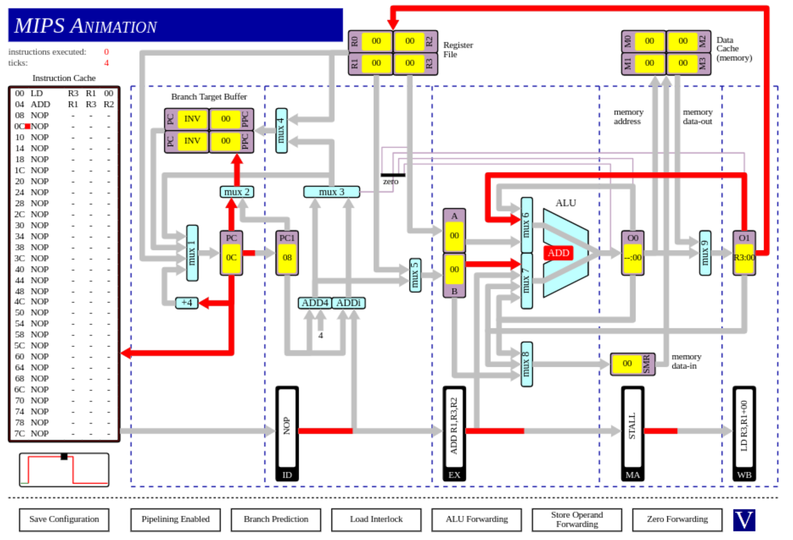
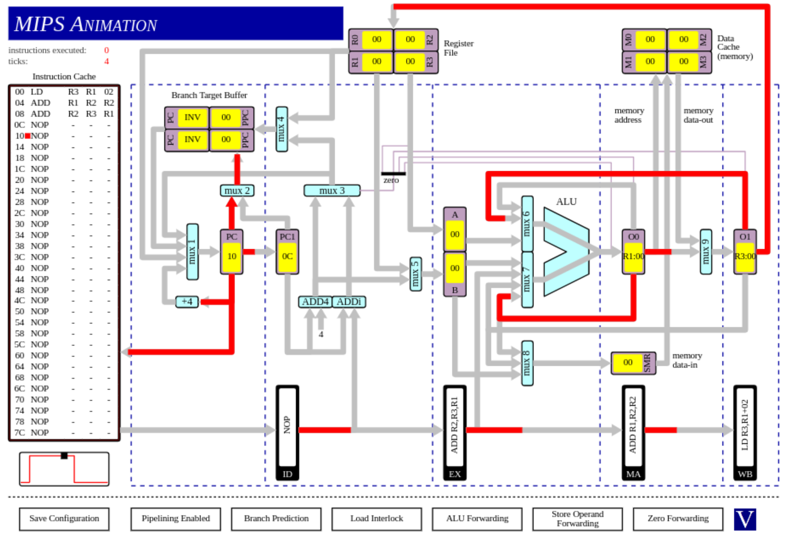
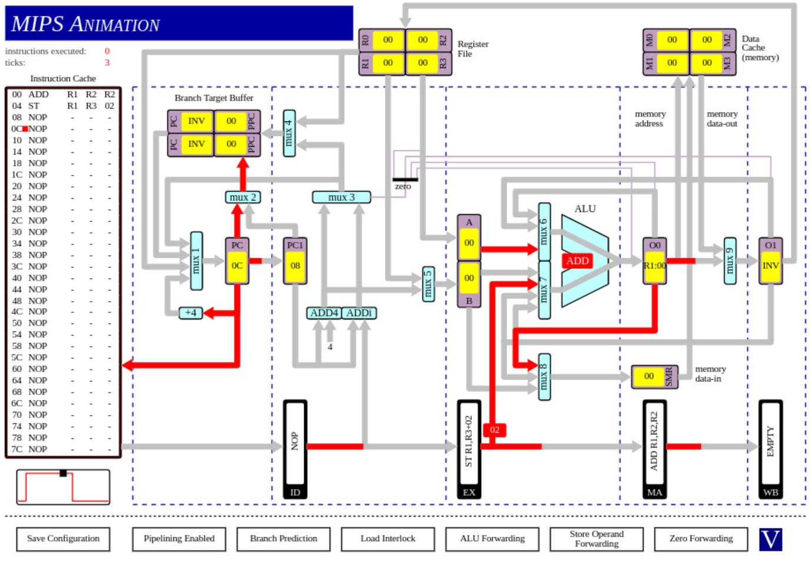
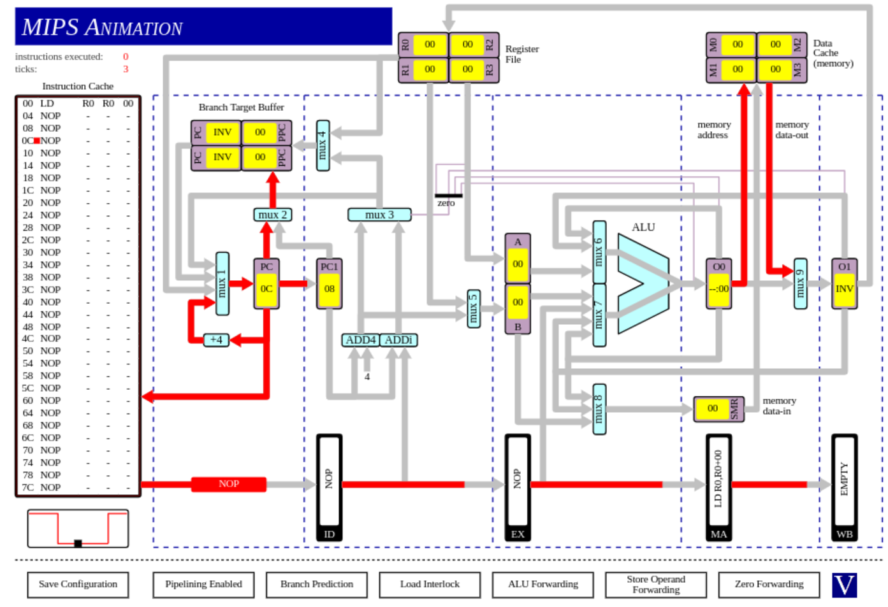
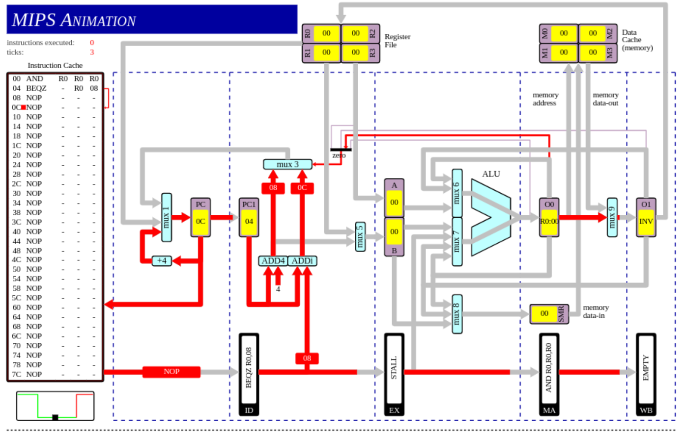
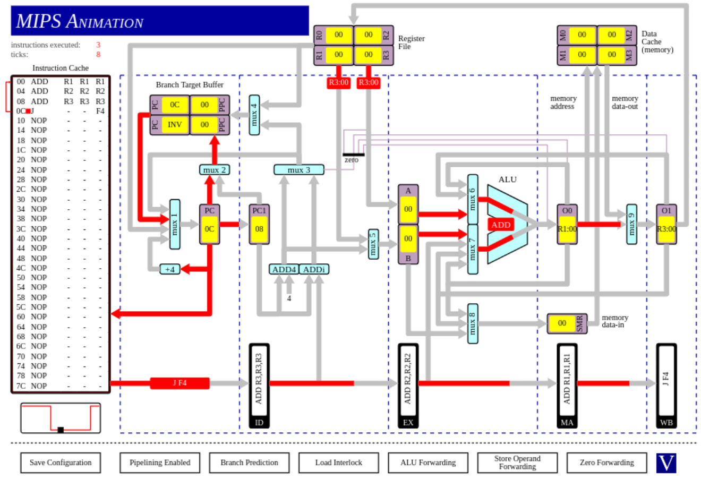
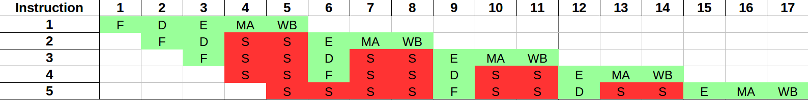
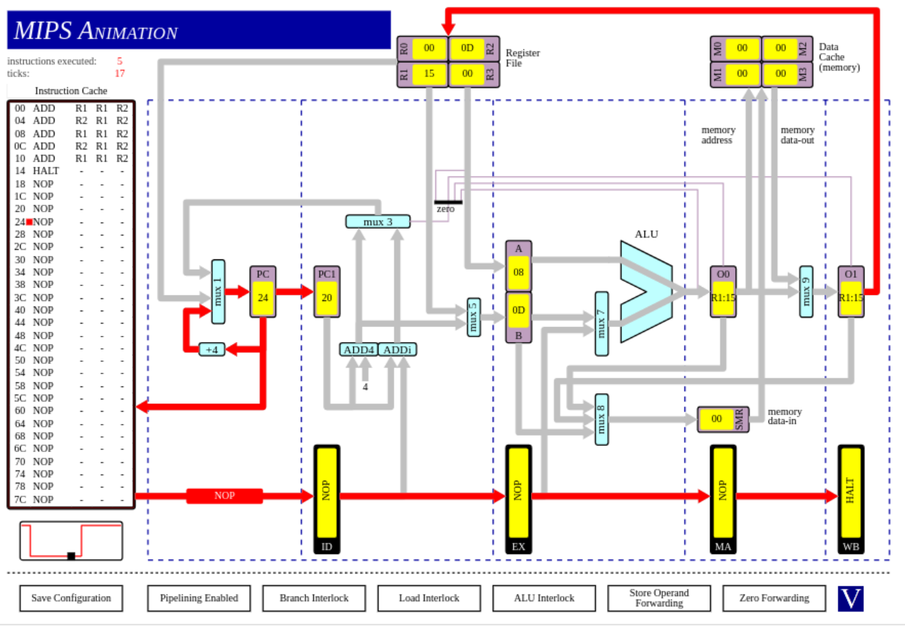
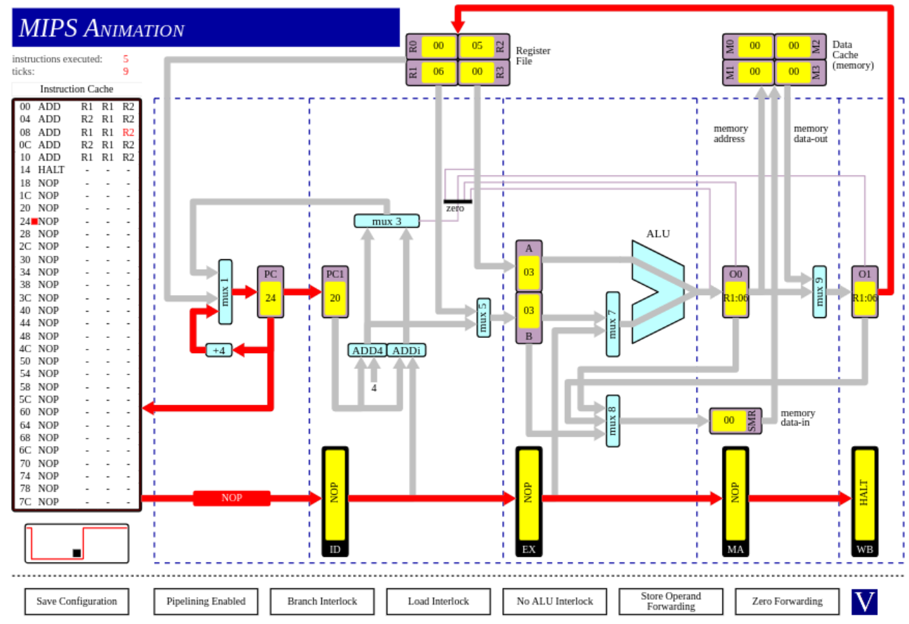

# Tutorial 4: MIPS
Name: Stefano Lupo   
Student Number: 14334933   
Date: 17/11/17   
Course: Computer Engineering   
Module: CS3421 Computer Architecture II   

# Q1
### O1 to MUX6
- This datapath would be used when there is a memory access hazard (an instruction uses a register whos value is currently being loaded in from memory)
```assembly
  LD    r3, r1, x       ; Load into r3, from the address contained in r1, offset by x
  ADD   r1, r3, r2      ; r1 = r3 + r2
```

   
### O0 to MUX7 and O1 to MUX 6
- The **O1 -> MUX6** datapath is used due to memory access hazards as before.
- The **O0 -> MUX7** datapath is used to due a data hazard
```assembly
  LD    r3, r1, x       ; Load from memory
  ADD   r1, r2, r2      ; r1 = r2 + r2
  ADD   r2, r3, r1      ; r2 = r3 + r1 - this requires both of the source registers from the previous two instructions
```


### O0 to MUX8
- This datapath is used when the result of an ALU operation is required to be written to memory on the next instruction.
- The result of the ALU operation will have made it to O0, and is then required to be in SMR (memory data in) on the next tick.
- Thus the ALU forwards it's result from O0 to SMR through MUX8.
```assembly
  ADD   r1, r2, r2      ; r1 = r2 + r2
  ST    r1, r3, x       ; store r1 @ address r3 + x
```


### EX to MUX7
- This datapath is used when an *effective memory address* calculation is performed by the ALU.
- The desired offset from the specified memory address is contained in the machine code for the instruction.
- Thus this offset is added to the specified memory address (contained in the given register).
```assembly
  ADD   r1, r2, r2      ; r1 = r2 + r2
  ST    r1, r3, 2       ; store r1 @ address r3 + 2
```


### Data Cache to MUX 9
- This datapath is used during the memory access stage of loading data from memory.
```assembly
  LD    r0, r0, r0      ; Load data from memory
```


### O0 to Zero Detector
- This datapath is used when a branch if equal (or not equal) to zero instruction is executed after some sort of compare operation.
- The result of the compare operation determines whether or not the branch should be taken.
- This is done by detecting if the result was zero and using that to control mux3 (which controls whether or not the branch should be taken).
```assembly
  AND     R0, R0, R0      ; Some operation to act as a comparison (equivalent to setting condition code flags)
  BEQZ    _, R0, x        ; Branch if the result of the previous operation was 0
```


### Register File to MUX1

```assembly

```


### Branch Target Buffer to MUX1
- This datapath will be used when a PC that contains a branch instruction is reached AND that PC has been seen before.
  - This means the BTB knows where this branch should go and thus it can supply the next PC to MUX 1.
- A small infinitely looping program demonstrates this.
  - Initially the `jump -12` instruction (PC = 0x0c) will not be in the BTB and must be calcualted etc (producing stalls)
  - Every subsequent time we reach 0x0C, the BTB will simply supply the next PC producing no stalls.
- The screenshot below shows the loop after a few iterations and thus the next PC is contained in the BTB.

```assembly
  ADD     r1, r1, r1      ; Dummy loop body
  ADD     r2, r2, r2      ; Dummy loop body
  ADD     r3, r3, r3      ; Dummy loop body
  J       0xF4            ; Jump back to start of the loop

```


    
# Q2
The **correct** program would be the following:
```
r1 = 1
r2 = 2
r1 = r1 + r2 = 1 + 2 = 3
r2 = r1 + r2 = 3 + 2 = 5
r1 = r1 + r2 = 3 + 5 = 8
r2 = r1 + r2 = 8 + 5 = 13
r1 = r1 + r2 = 8 + 13 = 21
```
Therefore the resulting value of r1 should be 21.

## ALU Forwarding Enabled
Assuming pipeline is initally empty, the instructions will execute as follows:   

| Instruction   |  1  |  2  |  3  |  4  |  5  |  6  |  7  |  8  |  9  |
| ------------- |-----|-----|-----|-----|-----|-----|-----|-----|-----|
| I1            |  F  |  D  |  E  |  M  |  W  |     |     |     |     |
| I2            |     |  F  |  D  |  E  |  M  |  W  |     |     |     |   
| I3            |     |     |  F  |  D  |  E  |  M  |  W  |     |     | 
| I4            |     |     |     |  F  |  D  |  E  |  M  |  W  |     |  
| I5            |     |     |     |     |  F  |  D  |  E  |  M  |  W  |

Thus it will require a total of 9 clock cycles and will produce the correct answer of 21 due to ALU forwarding.

## ALU Forwarding Disabled, CPU data Dependency Interlocks Enabled
Since ALU forwarding is now disable, we need a mechanism to handle data hazards (since our program is full of them - one on every instruction in fact). CPU Data Dependency Interlocks can fulfill this role. These work by stalling the pipeline until the data dependency is resolved whenever a data dependency is discovered. That is, the execution phase of the following instruction is stalled by two cycles until the write back phase of the current instruction is completed.

The stalls occur for two reasons:
1. The next process cannot progress to the next phase of the pipeline until the previous process is progressing to the phase after that.
  - For example, P2 cannot fetch until P1 is decoding, otherwise P2's data would overwrite P1's data.
2. No process can execute until its predecessor has finished writing back (exited the pipeline).
  - This is due to the data hazard problem

Thus the program will compute the correct result of 21, but will require more clock cycles due to the stalls.    

The pipeline with stalls is shown below.     

   

Thus the total number of clock cycles required is **17**.    
*Note this does not include the clock cycles for the HALT instruction and instead shows the more interesting number of clock cycles to compute the answer.* 

Running the simulation gave the same total of 17 clock ticks to execute the 5 instructions and produced a result of 0x15 which is 21 as expected.



## ALU Forwarding Disabled and Data Dependency Interlocks Disabled
Now that we have no mechanism of detecting data hazards, the computed answer will be incorrect due to non updated values of R1 and R2 being used between subsequent instructions. However there will be no stalls in this pipeline and thus we expect the same number of clock cycles as the case when ALU forwarding was enabled (causing no stalls).

As expected, the simulation shows that it will take a total of 9 clock cycles to execute the 5 instructions and the resulting answer will 6 instead of the correct 21 due to the data hazards.




# Q3
## Number of instructions and clock cycles
After running the program we see that the total number of instructions executed was 22 and the total number of clock cycles was 28.

### Pipelining
The first reason for the discrepancy between the number of instructions and clock cycles is due to the fact that the pipeline was empty at the begining of program execution. Thus the CPU is not operating at maximum efficiency (1 instruction being completed per tick) until the pipe line is filled.   
The forumla for the number of cycles to execute n instructions for a given pipeline size that starts off empty is:
> #cycles = n + (pipelineSize - 1)

Thus for our pipeline size of 5:

> #cycles = 22 + (5 - 1) = 26

Thus we expect the program to take an extra four cycles due to the pipeline starting off empty.

### Stalls
However there is still an extra 2 unexplained cycles. The reason for these extra 2 cycles is due to pipeline stalls.    
The first time a stall is encountered is upon reaching the `J E0` instruction for the first time. As this is an unconditonal branch, this branch will always be taken and thus on the first time it is reached, it creates a pipeline stall. This is due to the fact that when the jump instruction is being decoded, the memory address of the next PC (the one to jump to) is being calculated. Thus this produces a stall of 1 clock cycle.
    

However once this happens, the Branch Target Buffer caches this result and thus any subsequent times we reach the `J E0` instruction (PC = 24), we can fetch the cached resulting PC from the BTB, avoiding any further stalls.

Finally, the `BEQZ -, R2, 24` instruction (PC = 04) will finally be taken once R2 reaches zero to allow the program to break out of the loop. This will again cause a stall for the same reason as the above, accounting for our final missing clock cycle.

    
## No Branch Prediction
If we consider the important components (from a clock cycles point of view) of the program execution for the given case of `r2 = 3 = 0011` and `r3 = 4 = 0100` we find the following:
```
  ; Start Execution
  BEQZ r2, 24         ; r2 = 0011 != 0 so No branch taken
  SRLi r2, r2, 1      ; r2 = 0001
  J E0                ; Stall 1

  ; After first iteration
  BEQZ r2, 24         ; r2 = 0001 != 0 so No branch taken
  SRLi r2, r2, 1      ; r2 = 0000
  J E0                ; Stall 2

  ; After second iteration
  BEQZ r2, 24         ; r2 = 0000 == 0 so branch taken -> Stall 3

```

Thus we see that we expect a total of 3 pipeline stalls due to to the branches. However 2 of these branches are for the same PC and thus when we used branch prediciton, the BTB allowed us to avoid the second stall due to `J E0`.

    
However with branch prediciton replaced by interlocking, this no longer happens and thus we expect to have a stall for the second `J EO` as well as the first. Thus we expect that we will have 1 more stall when no branch prediction is used than when it is (for this specific program). That is we expect 29 clock cycles instead of the 28 clock cyles that were noted when branch prediction was used.


Upon running the simulation with *branch interlock* enabled instead of *branch prediction* we see the program required 29 clock cycles as expected.


## Swapping Shift Orders
Swapping the order of the shift operations results in creating an extra stall for every iteration of the loop. This is due to the fact that it creates a load hazard. The culprit here is the following:

```Assembly
  LD    r2, r0, 0       ; r2 = [r0]
  SRLi  r2, r2, 1       ; r2 = r2 * 2
```

The hazard here is due to the fact that during the execution phase of `LD r2, r0, 0` the ALU calculates the memory address that is to be read from. Once this is completed, the instruction moves into the memory access phase where it can read this value from memory into **r2**.


However, when once the load instruction moves into the memory access phase, it is immediately followed by the shift instruction `SRLi r2, r2, 1` entering the execution phase. Thus the execution of the shift instruction relies on the value being currently read in from memory by the load instruction creating a stall. 


Thus as these load and shift instructions are performed once per iteration of the loop, they produce one stall per iteration of the loop. As shown, the loop iterates twice for the given setup and thus two extra stalls are produced as a result.


Examining the simulation showed a total of 30 clock cycles required when using branch prediction and 31 clock cycles when not using branch prediciton - a difference of two cycles for both methods as expected as branch prediciton has no impact on load hazards. 
