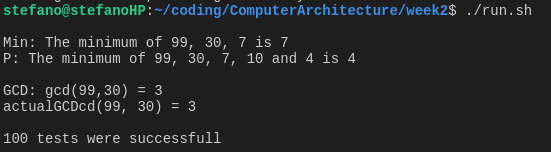

# Tutorial 1: Function Calling in x86
Name: Stefano Lupo   
Student Number: 14334933   
Date: 3/10/17   
Course: Computer Engineering   
Module: CS3421 Computer Architecture II   
   

# Q1 IA32 Code for the Three Functions
## int min(int a, int b, int c)
This function returns the minimum of `a`, `b`, and `c`.
```Assembly
min:
  // Save context
  push ebp                  // Save old frame pointer
  mov ebp, esp              // Set our new frame pointer
  sub esp, 4                // Allocate space for local variables
  // NA                     // Save non volatile registers (ebx)
  
  mov eax, [ebp + 8]        // eax = a
  mov [ebp-4], eax          // v = a
  mov ecx, [ebp+12]         // ecx = b
  cmp ecx, eax              // cmp(b,v)
  jge b_greatereq_v
  mov ecx, [ebp+12]         // ecx = b (mechanical)
  mov [ebp-4], ecx          // v = b

b_greatereq_v:
  mov eax, [ebp+16]         // eax = c
  mov ecx, [ebp-4]          // ecx = v
  cmp eax, ecx
  jge c_greatereq_v
  mov eax, [ebp+16]         // eax = c
  mov [ebp-4], eax          // v = c

c_greatereq_v:
  mov eax, [ebp-4]          // return v

  // Restore context
  mov esp, ebp
  pop ebp
  ret 0
```


## int p(int i, int j, int k, int l)
This function returns the minimum of the 4 passed parameters `i`, `j`, `k`, `l` and global variable `g` by making use of the previously defined `min` function.

```Assembly
p: 
  // Save context
  push ebp                  // Save old frame pointer
  mov ebp, esp              // Set our new frame pointer
  sub esp, 4                // Allocate space for local variables
  // NA                     // Save non volatile registers (ebx)

  // v = min(g, i, j)
  push [ebp+12]             // push j
  push [ebp+8]              // push i         
  push g                    // push g
  call min
  mov [ebp-4], eax          // save result of function call in v
  add esp, 12               // pop the 3 pushed parameters off the stack

  // return min(v, k, l)
  push [ebp+20]             // push l
  push [ebp+16]             // push k
  push [ebp-4]              // push v
  call min                  // eax = min(v, k, l) 

  // Restore context
  mov esp, ebp
  pop ebp
  ret 0
```

## int gcd(int a, int b)
This recusrive function find the greatest common divisor of `a` and `b`.   
```Assembly
gcd: 
  // Save context
  push ebp                  // Save old frame pointer
  mov ebp, esp              // Set our new frame pointer
  // NA                     // Allocate space for local variables
  // NA                     // Save non volatile registers (ebx)

  // Check if b is zero
  mov eax, [ebp+12]         // eax = b
  test eax, eax             // eax && eax (zero iff eax was 0)
  je zero


  /*
    div divides the 64 bits across EDX|EAX by the operand
    div stores the result of the division in EAX and the remainder in EDX
  */

  // Set up operands, compute a % b
  xor edx, edx              // Clear upper 32 bits
  mov eax, [ebp+8]          // eax = a (numerator)
  mov ecx, [ebp+12]         // ecx = b (denominator)
  div ecx                   // eax = (edx|eax / ecx, edx = (edx|eax) % ecx

  // push parameters
  push edx                  // push a % b
  mov eax, [ebp+12]         // eax = b
  push eax                  // push b

  // recurse
  call gcd

  // pop two pushed parameters
  sub esp, 8
  jmp return
 
zero:
  mov eax, [ebp+8]          // return a

return: 
  // Restore context
  mov esp, ebp
  pop ebp
  ret 0
```


# Q2: Stack for gcd(14, 21)
In computing the gcd of 14 and 21, code execution would be as follows:
```
1 gcd(14,21)
   b != 0
   return gcd(b, a % b) - return gcd(21, 14)
2 gcd(21, 14)
   b != 0
   return gcd(b, a % b) - return gcd(14, 7)
3 gcd(14, 7)
   b != 0
   return gcd(b, a % b) - return gcd(7, 0)
4 gcd(7, 0)
   b == 0
   return a - return 7
```
   
This shows that the maximum depth of stack (in stack frames) is 4.
   
This means the stack would contain the following:


# Q3: Testing the Functions *(test.c)*
This small C program can test each of the functions.   
```c
#include <stdio.h>
#include <time.h>
#include <stdlib.h>

#include "asmFunctions.h"

int actualGCD(int a, int b) {
    if(b==0) {
        return a;
    }

    return actualGCD(b, (a % b));
}

int main() {
    // Set seed for random numbers
    srand(time(NULL));

    int a = 99, b = 30, c = 7, d = 10;
    printf("\nMin: The minimum of %d, %d, %d is %d\n", a, b, c, min(a,b,c));
    printf("P: The minimum of %d, %d, %d, %d and %d is %d\n", a, b, c, d, g, p(a,b,c,d));
    printf("\nGCD: gcd(%d,%d) = %d\n", a, b, gcd(a, b));
    printf("actualGCDcd(%d, %d) = %d\n\n", a, b, actualGCD(a, b));

    // Test two algorithms 100 times
    for(int i=0;i<100;i++) {
        int x = rand() % 100, y = rand() % 100;
        int actual = actualGCD(x,y);
        int assembly = gcd(x,y);
        if(actual != assembly) {
            printf("Error in algorithm\n");
            printf("gcd(%d, %d) = %d but algorithm returned %d\n\n", x, y, actual, assembly);
            exit(0);
        } 
    }   

    printf("100 tests were successfull\n\n");   
    return 0;
}
```
   
This produced the following console output, indiciating that all of the functions work correctly.
   


